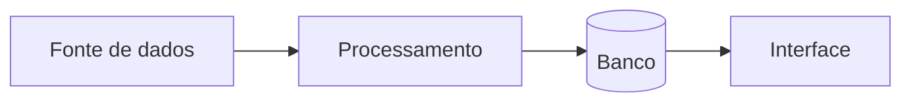
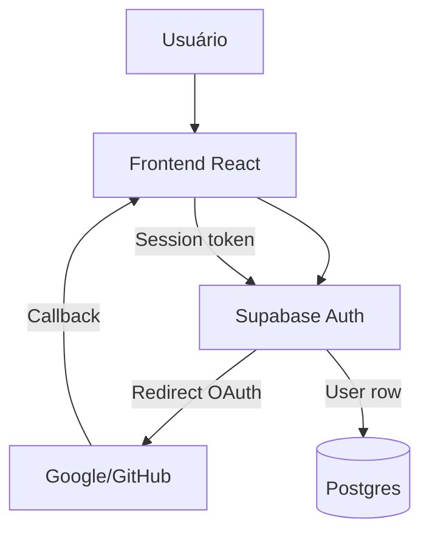
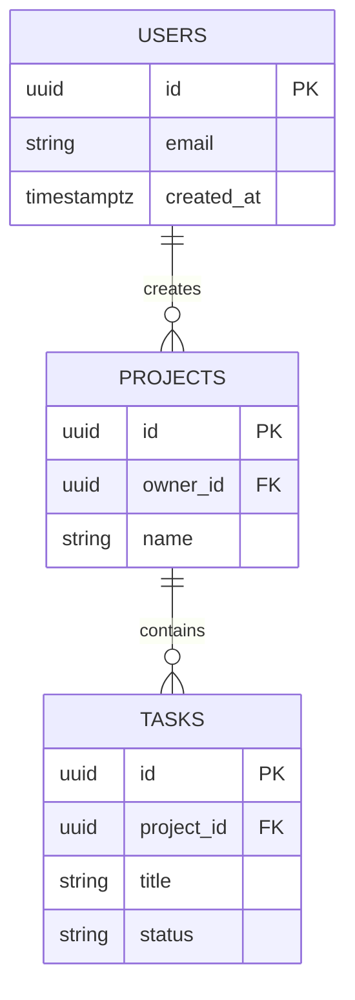
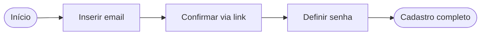

# /excalidraw-diagram — Diagramas técnicos via Excalidraw e Mermaid

> Status: **FUNCIONAL** (bundled em 2026-05-18, re-implementação universalizada).

## Princípio

**Diagrama bom > 1000 palavras de prosa** pra descrever arquitetura, fluxo de dados, decisões e estruturas. Esta skill aceita descrição natural e produz:

- **Mermaid** (renderiza direto em GitHub, GitLab, Markdown — escolha default)
- **Excalidraw JSON** (pra edição visual posterior em excalidraw.com)

## Quando usar

- Documentar fluxo de dados (entrada → processamento → saída)
- Desenhar arquitetura de feature antes de implementar
- Visualizar schema de banco (tabelas + relações)
- Diagramar fluxos de UX/navegação
- Criar diagrama pra apresentação ou doc técnica
- ANTES de decisão arquitetural grande (alinhamento visual reduz mal-entendido)
- Em sessões de `/brainstorming` quando o tópico é visual

## Quando NÃO usar

- Mudança trivial sem componente arquitetural
- Documento de regra/princípio (markdown puro é melhor)
- UI mockups (use ferramenta de design — Figma, Sketch — não diagrama técnico)

## Formatos suportados

### Mermaid (recomendado pra docs em git)

Renderiza nativo em GitHub/GitLab/qualquer markdown viewer:



**Tipos comuns:**
- `flowchart LR/TB` — fluxos com setas direcionais
- `sequenceDiagram` — interações entre atores ao longo do tempo
- `erDiagram` — schema de banco com relações
- `classDiagram` — UML de classes/módulos
- `stateDiagram-v2` — máquinas de estado
- `gantt` — cronograma

### Excalidraw JSON (pra edição visual)

Gera JSON que cola direto em [excalidraw.com](https://excalidraw.com) ou no plugin Excalidraw do VS Code. Permite refinar layout, cores, anotações manuais.

### Plain ASCII (fallback)

Quando o destino é terminal ou doc super-leve:

```
[Fonte] --> [Processamento] --> [Banco] --> [Interface]
```

## Workflow

### 1. Recebe descrição natural

Usuário descreve o que quer diagramar em prosa:

> "Desenha o fluxo: usuário faz upload no app → vai pra storage → trigger dispara função → função processa + insere no banco → notificação real-time pro app"

### 2. Identifica tipo de diagrama

Heurística por palavras-chave na descrição:

| Palavras na descrição | Tipo Mermaid |
|---|---|
| "fluxo", "step", "passos", "etapas", "→" | `flowchart` |
| "interação", "request/response", "ao longo do tempo" | `sequenceDiagram` |
| "tabela", "schema", "FK", "relacionamento" | `erDiagram` |
| "estado", "status", "máquina de estados", "transição" | `stateDiagram-v2` |
| "classe", "módulo", "hierarquia" | `classDiagram` |
| "cronograma", "timeline", "fase" | `gantt` |

Quando ambíguo: pergunta `AskUserQuestion` com 2-3 opções.

### 3. Gera diagrama

Produz o markdown/JSON conforme tipo escolhido.

### 4. Valida com o usuário

> "Diagrama gerado. Cobre [resumo do que mostrou]. Algo ficou de fora ou está confuso? Posso ajustar layout, adicionar nós, ou trocar tipo de diagrama."

### 5. Sugere onde salvar

- **Mermaid:** embutir direto em `.md` da pasta `docs/` ou `docs/decisoes/`
- **Excalidraw:** salvar como `.excalidraw` em `docs/diagramas/`
- **ASCII:** inline no doc onde foi pedido

## Exemplos de uso

### Arquitetura de feature

> "/excalidraw-diagram Desenha a arquitetura do sistema de autenticação: frontend React, Supabase Auth, redirect, callback"



### Schema de banco

> "/excalidraw-diagram Mostra as tabelas users + projects + tasks com FKs"



### Fluxo de UX

> "/excalidraw-diagram Diagrama o fluxo de cadastro com 4 etapas: email → confirmar → senha → done"



## Onde salvar diagramas

- **Diagramas Mermaid** — embutidos nos arquivos `.md` em `docs/` (renderizam direto no GitHub)
- **Diagramas Excalidraw** — salvar como `.excalidraw` em `docs/diagramas/`
- **Diagramas pra apresentação** — exportar PNG via excalidraw.com depois

## Anti-padrões

| ❌ Errado | ✅ Certo |
|---|---|
| Diagrama com 20+ nós (ilegível) | Decompõe em 2-3 diagramas menores |
| Sem direção clara das setas (caos visual) | Sempre LR ou TB, escolhe e mantém |
| Cores arbitrárias sem significado | Cor codifica algo (verde=funcional, vermelho=problema, cinza=desabilitado) |
| Diagrama sem legend quando usa abstrações | Adiciona legenda inline |
| Misturar tipos de diagrama (flowchart + sequence no mesmo) | Um tipo por diagrama |

## Skills relacionadas

- **`/brainstorming`** — pode invocar essa skill quando design tem componente visual
- **`/writing-plans`** — planos arquiteturais podem incluir Mermaid embutido
- **`/criar-contexto`** — contexto de cliente pode ter diagramas de arquitetura

## Atribuição

Esta skill foi **bundled em 2026-05-18** por re-implementação universalizada a partir de skill local da máquina dev. Source original era altamente acoplada a um projeto específico (TrackOps); versão atual é genérica reutilizável.

## Diferenças vs source original

- Removidas TODAS as referências a TrackOps, Field Control, Transposeg, tabela `placas`, "Fase 1.5/1.6"
- Removidos exemplos específicos (fluxo `Drive → importar-drive-diario.js → tabela placas`)
- Adicionados: 6 tipos de diagrama Mermaid + heurística de detecção
- Adicionado: formato ASCII fallback
- Adicionados: 3 exemplos universais (autenticação, schema, cadastro)
- Adicionado: workflow 5 etapas formalizado
- Adicionado: seção Anti-padrões
- Cross-references com skills KODAI universais
