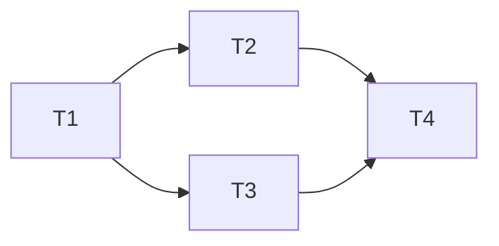

# Skill: `/plan` — Plano Executável (passo 3/6 do pipeline)

> **Plano = ordem + paralelismo + checkpoints + stop-criteria.** Tasks soltas (de `/break`) não bastam — plano define o **fluxo de execução**.

## Princípio

`/break` decompõe **o quê** fazer. `/plan` define **como executar**:

- **Ordem cronológica** (respeitando DAG das tasks)
- **Paralelismo** (quais tasks rodam simultâneas — quando aplicável)
- **Checkpoints** (após qual task, parar pra reportar?)
- **Stop-criteria** (quando abortar o plano inteiro?)
- **Quem executa** (humano, IA solo, sub-agente, multi-agente)

`/plan` é **opcional** quando tasks são triviais lineares (≤3 tasks). Vira **obrigatório** quando há ≥4 tasks OU paralelismo OU múltiplos executores.

## Quando disparar

- "/plan <spec-path>"
- "fazer plano de execução"
- "como executar essas tasks"
- "ordem de execução"
- Após `/break` quando tasks ≥4 ou complexidade alta

**Pular quando** tasks ≤3 lineares — ir direto pra `/execute`.

## Workflow 5 passos

### 1. Carregar spec + tasks

```bash
cat docs/decisoes/<spec>.md
# Verificar seção ## Tasks (ou arquivo .tasks.md)
```

Validar:
- Tasks têm ID + dependências + critério de done
- DAG é válido (sem ciclo)

### 2. Aplicar metodologia de planejamento

Compor com skill bundled `/writing-plans` (princípios canônicos: Subagent-Driven Development, vertical slices, validation gates).

Decisões a tomar:

| Decisão | Opções |
|---|---|
| **Ordem** | DAG topological sort OU manual override (justificar) |
| **Paralelismo** | Sequential | parallel-2 | parallel-3 (limite quota IA) |
| **Executor** | Humano | IA solo | sub-agente background | multi-agente |
| **Checkpoints** | A cada task | a cada 3 tasks | só no final |
| **Stop-criteria** | 1 task fail | erros recorrentes | budget exceeded |

### 3. Escrever plano (formato canônico)

```markdown
## Plano

### Sequência



### Execução

| Fase | Tasks | Executor | Duração estimada | Checkpoint |
|---|---|---|---|---|
| 1 | T1 | IA solo | 30min | ✓ reportar diff antes de T2 |
| 2 | T2, T3 (paralelo) | sub-agentes background | 1h | ✓ aguardar ambos terminarem |
| 3 | T4 | IA solo | 1h | ✓ Evidence Bloc obrigatório |

### Stop-criteria

- Se T1 falhar com tsc error → ABORTAR, voltar pra /spec
- Se T2 OU T3 falhar → continuar com a outra + reportar
- Se qualquer task exceder estimativa 3× → pausar + replanejar

### Risco residual após plano

[lista riscos que /spec apontou + qual task mitiga cada um]
```

### 4. Validação (auto-check)

- [ ] Ordem respeita DAG das tasks
- [ ] Paralelismo declarado (sequential default)
- [ ] Checkpoints definidos (mín 1)
- [ ] Stop-criteria explícitos
- [ ] Risco residual mapeado de volta pros itens da `/spec`

### 5. Persistir + commit

Adicionar `## Plano` à spec (preferido) ou criar `docs/decisoes/<spec>.plan.md` separado.

```bash
git add docs/decisoes/<...>
git commit -m "plan(<escopo>): plano de execução pra N tasks"
git push
```

## Quality Gates

```yaml
quality_gates:
  - "Spec + tasks carregadas e validadas"
  - "Ordem respeita DAG"
  - "Paralelismo declarado"
  - "Checkpoints mín 1 (após task crítica)"
  - "Stop-criteria explícitos"
  - "Riscos mapeados pra tasks"
  - "Commit + push imediato"
```

## Anti-padrões

| Padrão | Problema | Correção |
|---|---|---|
| Plano sem checkpoints | IA executa 10 tasks sem reportar | Mín 1 checkpoint após task crítica |
| Paralelizar tasks dependentes | Race condition | Verificar DAG antes |
| Plano sem stop-criteria | IA insiste em task que vai falhar | Definir quando ABORTAR |
| Estimativas chumbadas no plano | Atraso vira mentira nos docs | Marcar status real na execução |

## Bridging

```yaml
sugere_proxima_skill:
  - condicao: "plano aprovado"
    skill: execute
    razao: "Executar plano com commits granulares"

requires_skills_anteriores:
  - condicao: "tasks não decompostas"
    skill: break
```

## Limitações

- Plano é estimativa — `/execute` reporta desvio real
- Multi-agente paralelo limitado a 3 sub-agentes simultâneos (quota Anthropic)
- Stop-criteria humano sempre override automático

## Origem

Skill canônica pipeline KOD.AI. Wrapper semântico sobre `/writing-plans` (bundled methodology) — adiciona ancoragem ao output de `/break` + commit imediato. Criada 2026-05-22 pós-audit item 2.
